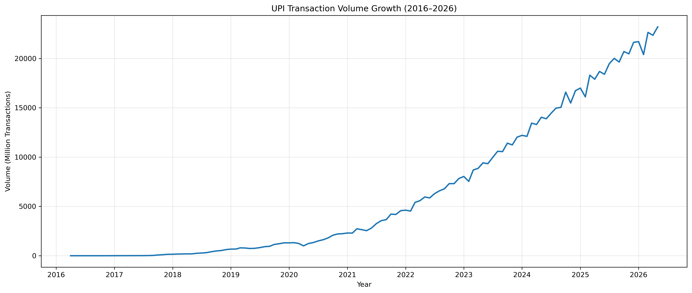
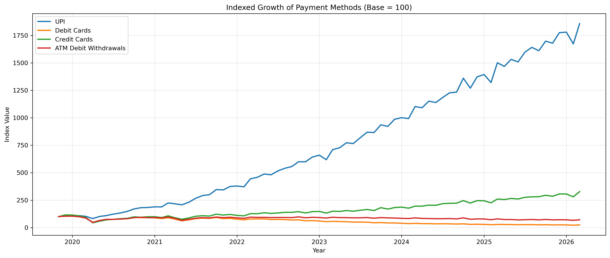
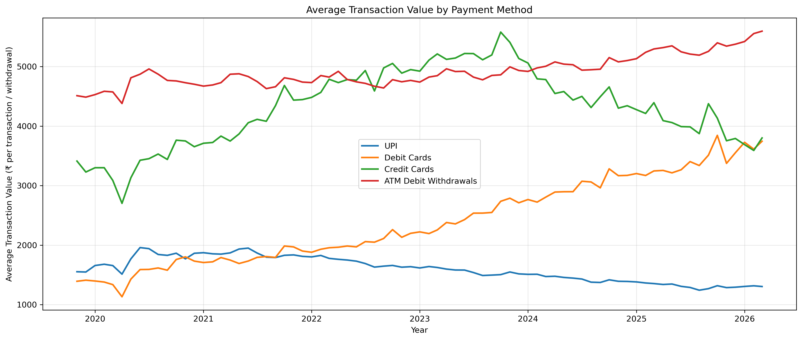

# Is UPI Changing the Way India Pays?

## Project Overview

UPI has become one of the most visible changes in India's payment ecosystem. From small shop payments to daily household transactions, UPI is now used almost everywhere.

But this project looks beyond the basic statement that “UPI is growing.”

The main question I wanted to answer was:

**Has UPI actually changed how India pays, and did it replace other payment methods like debit cards, credit cards, or cash withdrawals?**

To answer this, I analyzed NPCI UPI monthly statistics and RBI Payment System Indicators to compare UPI with debit cards, credit cards, and ATM debit withdrawals.

---

## Problem Statement

The goal of this project is to study how UPI adoption has affected consumer payment behavior in India.

This analysis focuses on four key questions:

* How fast has UPI grown since its launch?
* Did debit card usage decline as UPI grew?
* Did ATM withdrawals reduce, suggesting a possible decline in cash dependency?
* Did credit cards also decline, or did they grow alongside UPI?

---

## Data Sources

The project uses monthly transaction data from:

* **NPCI UPI Monthly Statistics**
* **RBI Payment System Indicators**

The analysis includes:

* UPI transaction volume and value
* Debit card transaction volume and value
* Credit card transaction volume and value
* ATM debit withdrawal volume and value

The UPI dataset covers the period from **2016 to 2026**, while the RBI payment ecosystem dataset covers **2019 to 2026**.

---

## Tools Used

* Python
* Pandas
* NumPy
* Matplotlib
* Jupyter Notebook
* Data Cleaning
* Exploratory Data Analysis
* Correlation Analysis
* Payment Method Comparison

---

## Methodology

The project involved cleaning and analyzing monthly payment data from NPCI and RBI.

Key steps included:

* Cleaned raw Excel and CSV files
* Handled messy RBI multi-row Excel headers
* Converted transaction volume and value columns into numeric format
* Standardized date columns for monthly time-series analysis
* Created key metrics such as CAGR, average transaction value, indexed growth, and transactions per bank
* Compared UPI with debit cards, credit cards, and ATM debit withdrawals
* Used correlation analysis to study how different payment methods moved with UPI growth

---

## Key Metrics

The main metrics used in this project were:

* UPI transaction volume
* UPI transaction value
* Average transaction value
* Transactions per bank
* CAGR
* Indexed growth
* Correlation with UPI volume

Some important results:

| Metric                                  |  Result |
| --------------------------------------- | ------: |
| UPI CAGR                                | 255.14% |
| UPI vs Debit Card Volume Correlation    |  -0.925 |
| UPI vs Credit Card Volume Correlation   |   0.986 |
| UPI vs ATM Debit Withdrawal Correlation |  -0.473 |

---

## Key Findings

### 1. UPI adoption scaled rapidly

UPI transaction volume increased sharply between 2016 and 2026. Growth was gradual during the early adoption period, but after 2020 the growth curve became much steeper.

This suggests that UPI moved from being a relatively new payment system to becoming a major part of India's digital payment infrastructure.

---

### 2. Debit card usage declined as UPI grew

Debit card transaction volume declined sharply during the same period in which UPI transaction volume increased rapidly.

This does not prove that UPI directly caused the decline, but the strong negative correlation suggests that debit cards may have become less relevant for everyday payments as UPI became more convenient and widely adopted.

---

### 3. ATM debit withdrawals declined moderately

ATM debit withdrawals also declined, but not as sharply as debit card transactions.

In this project, ATM debit withdrawals are used as a proxy for cash usage. Since this does not capture all cash transactions, it is not safe to claim that UPI replaced cash completely.

However, the trend suggests that UPI may have contributed to some reduction in cash withdrawal behavior.

---

### 4. Credit cards continued to grow alongside UPI

Credit card transaction volume increased strongly even as UPI grew.

This was one of the most important findings because it shows that UPI did not replace all payment methods equally.

Credit cards likely continued to grow because they serve different use cases such as short-term credit, EMI options, rewards, and larger purchases.

---

### 5. UPI became dominant for everyday payments

UPI had the lowest average transaction value among the payment methods analyzed.

This suggests that UPI is mainly used for frequent low-to-medium value transactions, making it strongly linked with everyday payments.

---

## Visualizations

### UPI Transaction Volume Growth



### Indexed Growth of Payment Methods



### Average Transaction Value by Payment Method



---

## Limitations

This analysis is based on aggregate monthly payment system data.

The results show trends and associations, but they do not prove causation.

Important limitations:

* Correlation does not prove causation
* ATM withdrawals are used only as a proxy for cash usage
* The data does not include rural vs urban adoption
* The data does not include user-level transaction behavior
* COVID-19 may have affected payment trends during the analysis period
* Other factors such as merchant acceptance, smartphone penetration, internet access, and consumer preferences may also influence payment behavior

---

## Conclusion

This project suggests that UPI has changed the way India pays, especially for everyday transactions.

The data does not support a simple story that UPI replaced every payment method. Instead, the impact appears to be uneven.

Debit card transactions declined sharply, ATM debit withdrawals declined moderately, and credit cards continued to grow.

Overall, India's payment ecosystem appears to have become more segmented. UPI dominates frequent low-to-medium value payments, while credit cards and cash withdrawals continue to serve different roles.

The strongest conclusion from this project is that **UPI transformed everyday payment behavior in India, but did not replace all payment methods equally.**

---

## Repository Structure

```text
UPI-Consumer-Economy/

├── data/
│   ├── raw/
│   └── processed/
│       ├── upi_master.csv
│       └── payment_ecosystem_clean.csv
│
├── notebooks/
│   ├── 01_data_audit.ipynb
│   ├── 03_eda.ipynb
│   ├── 04_payment_ecosystem_analysis.ipynb
│   └── 05_final_report_insights.ipynb
│
├── visualizations/
│   ├── upi_volume_growth.png
│   ├── indexed_payment_growth.png
│   └── average_transaction_value.png
│
├── reports/
│   └── final_report.md
│
└── README.md
```

---

## Skills Demonstrated

* Data cleaning
* Time-series analysis
* Exploratory data analysis
* KPI creation
* Unit conversion
* Correlation analysis
* Business insight generation
* Data storytelling using Python
